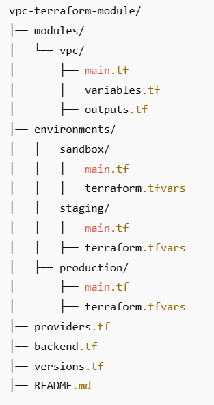

## Developing a VPC Terraform Module with Production and Non-Production AWS Accounts

This guide provides a step-by-step process for creating AWS accounts for Production and Non-Production environments and developing a reusable VPC Terraform module.

## Step 1: Create AWS Accounts for Production and Non-Production

Before deploying the VPC module, we need two AWS accounts:

1. **Non-Production Account** (for Sandbox environment)
2. **Production Account** (for Staging & Production environments)

## 1.1. Setting Up AWS Organizations
**AWS Organizations** allows you to create and manage multiple accounts under a single AWS Organization.

### Steps to Create a New AWS Account Under AWS Organizations:

1. Sign in to the AWS Management Console with an Administrator IAM role.
2. Open the AWS Organizations service.
3. Click **"Create Account"** → Provide:
   - **Account Name:** "NonProd"
   - **Email Address** (unique)
   - **IAM Role Name:** "OrganizationAccountAccessRole" (default)
  
  Repeat the process to create the **Production AWS Account.**
4. Confirm AWS Account Structure
   Run this command to list all accounts under your AWS Organization: 
```
   aws organizations list-accounts
```


## 1.2 Set Up Terraform Project Structure
Your Terraform project should follow this structure:



## 1.3 Define providers.tf to Use Different Accounts

Since your VPCs are in different accounts, use `assume_role` to deploy in the correct environment.


## 1.4.1 Create the VPC Module (`modules/vpc/main.tf`)
The VPC module will only create a VPC without other networking resources.


## 1.4.2  Define Module Variables (`modules/vpc/variables.tf`)


## 1.5 Call the Module for Each Environment
**Sandbox** (`environments/sandbox/main.tf`)
Uses the NonProd account.


**Staging** (`environments/staging/main.tf`)
Uses the **Production account.**


**Production** (`environments/production/main.tf`)
Uses the **Production account.**


## 1.6 Define Environment-Specific Variables (`terraform.tfvars`)

**Sandbox** (`environments/sandbox/terraform.tfvars`)


**Staging** (`environments/staging/terraform.tfvars`)


**Production** (`environments/production/terraform.tfvars`)


## STEP 2: Deploy the VPCs
### 2.1. Deploy Sandbox VPC (NonProd Account)

```
cd environments/sandbox
terraform init
terraform apply -var-file=terraform.tfvars -auto-approve
```
